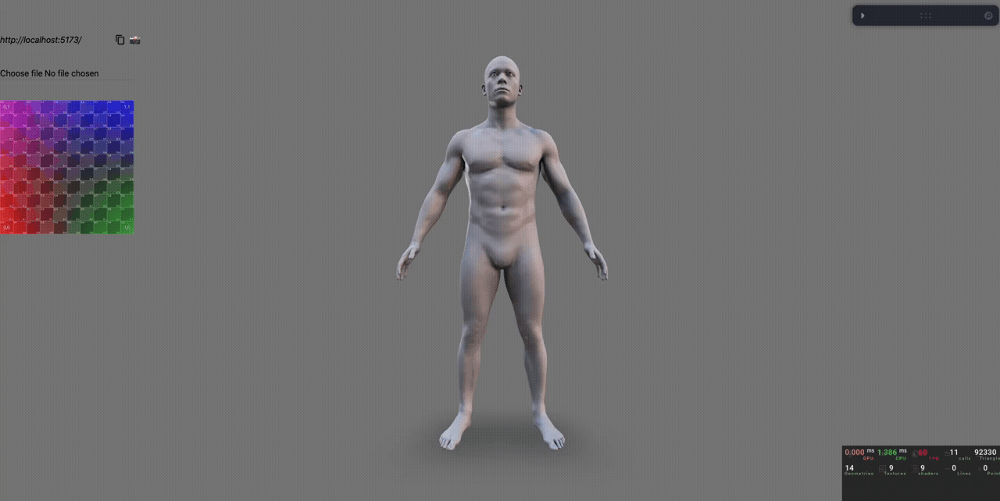

# Status
in progress..

# FleshRender

A 3D rendering application for applying and previewing decals on human models in real-time. Place custom tattoos, textures, and designs on 3D characters with interactive controls and material adjustments.

## Demo

## Features

- Real-time decal placement and preview on 3D models
- Adjustable material properties and lighting
- Interactive camera controls
- Multiple environment presets
- Material and texture selection

## Roadmap

**In Progress**
- Fix decal rotation and distortion handling
- Implement alternative decal projection methods (triplanar shaders)
- Basic UI and design system refinement
- Path tracing integration

**Planned**
- Extended decal library
- Shareable preview links with temporary asset hosting
